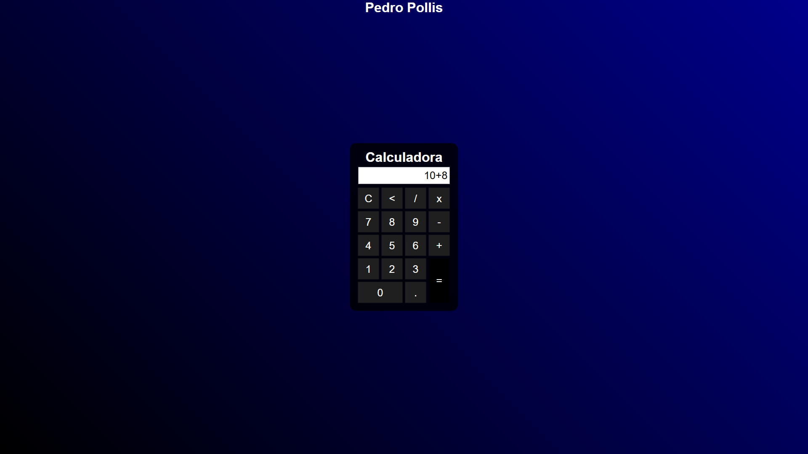

# 🧮 Basic Calculator

A simple calculator developed with HTML, CSS, and JavaScript as part of my initial studies in web development.

---

### ✨ Overview

This project is a functional calculator that performs the four basic mathematical operations (addition, subtraction, multiplication, and division). The main goal was to practice DOM manipulation with JavaScript and styling with CSS.

---

### 🚀 Technologies Used

-   **HTML5:** For the calculator's structure.
-   **CSS3:** For styling and design.
-   **JavaScript:** For all the logic and functionality.

---

### 📸 Screenshot

---

### 🔗 Project Link

You can see the calculator working here: [Basic Calculator - Live Demo](https://pedropollis.github.io/BasicCalculator/)
